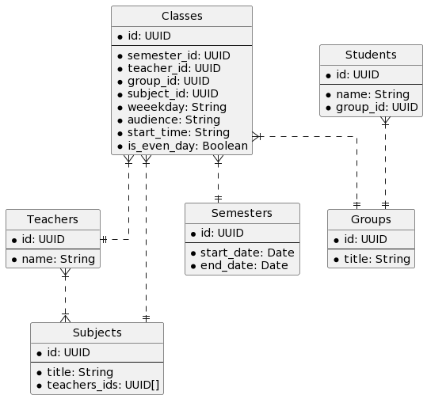

## Запуск

1. Генерация данных

```bash
node generate-data
```

2. Создание образа

```bash
docker build . -t click
```

3. Запуск контейнера

```bash
docker run -d -p 8123:8123 --name clickhouse --ulimit nofile=262144:262144 click
```
